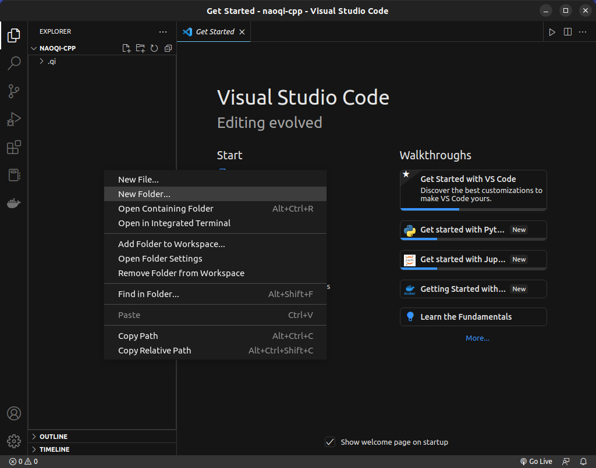
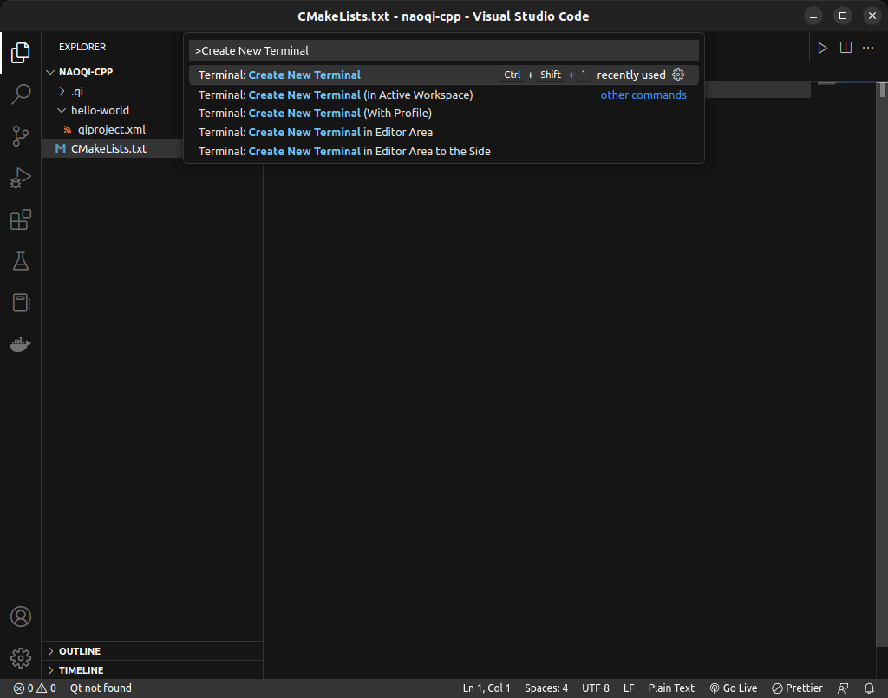
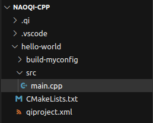

# Creating your first C++ project

Now that you have the NAOqi C++ SDK installed, this tutorial will walk you through running a simple "Hello, world!" program.

## Setting up your environment

Start by opening up Visual Studio Code. Click ":open_file_folder: Open Folder...", and navigate to your worktree directory. If you used robolab-installer, this folder will be found `~/Documents/naoqi-cpp`.

Right click within the Explorer pane (on the left side). Create a new folder, and name it `hello-world`.



### Creating qibuild.xml

Right click on the new folder you created, and create a file named `qiproject.xml`. This file is used by qiBuild to know how to manage dependencies between the libraries your project uses. Begin by specifying the project name and maintainer. 

=== "qibuild.xml"

    ``` html
    <project name="hello-world">
        <maintainer email="jdoe@mycompany.com">John Doe</maintainer>
    </project>
    ```

!!! note

    The name of your project directory and the project name in the file qiproject.xml do not necessarily have to be the same.

### Creating CMakeLists.txt

The file CMakeLists.txt is used to know how to build the source code corresponding to your project.

Right click on your project folder again, and create a file named CMakeLists.txt. In this file, you'll specify the minimum required version of CMake, your project name, and what file to build.

!!! note

    The file name is case-sensitive, so make sure you use the correct capitalization.

=== "CMakeLists.txt"

    ```
    cmake_minimum_required(VERSION 2.8)
    project(hello-world)
    find_package(qibuild)

    qi_create_bin(hello-world-bin "src/main.cpp")
    ```

### Configuring qiBuild

Now that you've specified your project information, you need to prepare qiBuild to build your project.

Open a terminal within VS Code by opening the Command Palette (`Control+Shift+P`), and entering "Create New Terminal".



Navigate to your project directory within the terminal, then run the qiBuild configure command.

``` bash
cd hello-world/
qibuild configure --release
```

!!! tip

    If you get an error upon configuring qiBuild, make sure both your `CMakeLists.txt` and `qiproject.xml` files are located **within your project folder**.

Upon successful configuration, there will be a build folder located within your project directory. 

## Writing your first program

{ align="right" }

### Creating your source tree

Begin your program by creating a folder called `src/` within your project folder, then creating a file named `main.cpp`. Your directory tree should look something like this:

### Writing your code

In main.cpp, write a simple "Hello, world!" program.

=== "main.cpp"

    ``` c++
    #include <iostream>

    int main()
    {
        std::cout << "Hello, world!" << std::endl;
        return 0;
    }
    ```

### Building your code

Click back into your terminal, and within your project directory, run the following command:

``` bash
qibuild make
```

This command creates an executable file in the `build-myconfig/sdk/bin` directory.

### Running your code

Navigate to the `build-myconfig/sdk/bin` directory within your terminal.

```
cd build-myconfig/sdk/bin
```

Finally, execute your binary.

```
./hello-world-bin
```

The program should output the following:

```
Hello, world!
```

Congratulations! You've successfully written your first C++ program using the qiBuild framework.