# Manual Installation

## Installing an SDK

### Choregraphe IDE

#### Downloading Choregraphe

Begin by downloading the installer from [Aldebaran's website](https://www.aldebaran.com/en/support/nao-6/downloads-softwares).

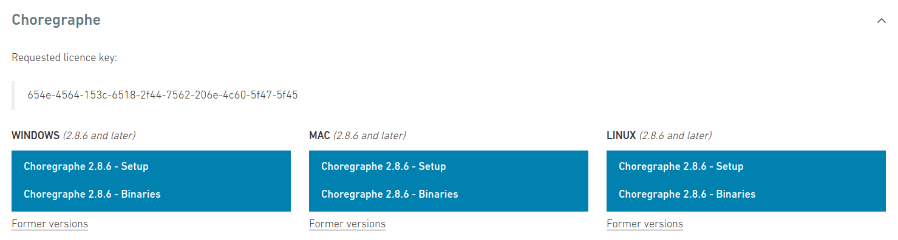

Under the Choregraphe > Linux category, choose Choregraphe 2.8.x - Setup.

#### Installing Choregraphe

After the software downloads, open your file manager and navigate to your downloads directory. Right click the background, and select "Open in Terminal".

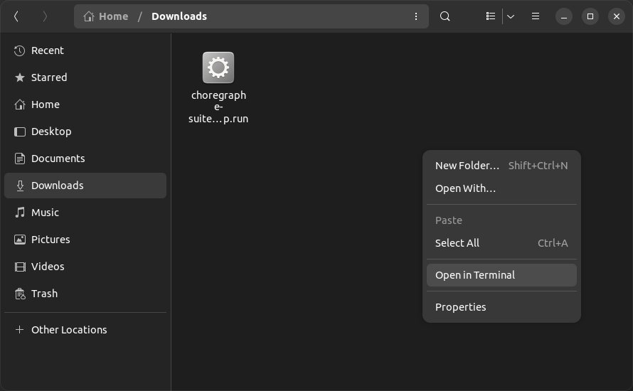

Once in a terminal, give the installer execute permissions:

``` bash 
chmod +x choregraphe-suite-*.run
```

Then, run the installer.

``` bash
./choregraphe-suite-*.run
```
The operating system will then prompt you for your administrator password. Enter it, then follow the prompts on the Choregraphe installer. Accept the license agreement, then when given the option to choose an installation mode, choose "Quick".

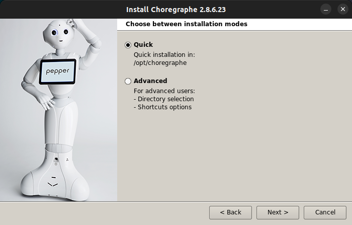

Continue through the installer. Once finished, if given the option, be sure to **uncheck** "Launch Choregraphe". 

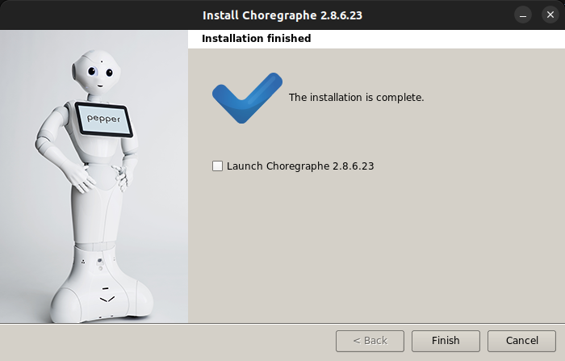

#### Patching zlib

Choregraphe was developed targeting a version of Ubuntu from 2016. Because of this, we must patch a library in order for the application to launch. 

Go back to your terminal, and run the following commands.

``` bash
cd /opt/choregraphe/lib/
sudo mv libz.so.1 libz.so.1.old
sudo ln -s /lib/x86_64-linux-gnu/libz.so.1
```

This replaces the bundled version of zlib with the version currently installed on the system.

Choregraphe is now successfully installed. Launch it from the :material-dots-grid: **Ubuntu Applications Menu**.

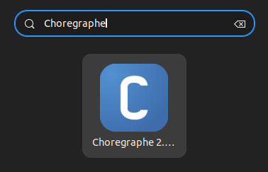

Proceed to [creating your first Choregraphe project]().

### Python SDK

#### Installing prerequisites

Begin by opening a terminal. Install the required prerequisites.

``` bash
sudo apt install python2.7 -y
```

#### Downloading the Python SDK

Then, download the SDK package from [Aldebaran's website](https://www.aldebaran.com/en/support/nao-6/downloads-softwares).

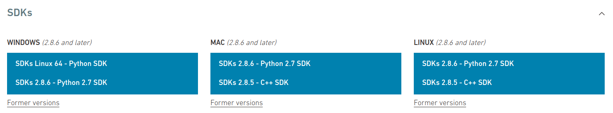

Under the SDKs > Linux category, choose SDKs 2.8.x - Python 2.7 SDK.

#### Extracting the Python SDK

Go back to your terminal, navigate to where the SDK was downloaded, and extract it. 

``` bash
sudo mkdir -p /opt/naoqi-python-sdk
sudo tar -xf pynaoqi-python2.7-*.tar.gz -C /opt/naoqi-python-sdk --strip-components=1
```

#### Updating your $PATH

Now, we need to tell the terminal where to find the Python SDK. To do this, add the following lines to your ~/.bashrc file.

``` bash
export PYTHONPATH=${PYTHONPATH}:/opt/naoqi-python-sdk/lib/python2.7/site-packages
export QI_SDK_PREFIX=/opt/naoqi-python-sdk
```

!!! tip

    An easy way to add these lines to your .bashrc without opening a text editor would be to echo the lines into the file.
    ``` bash
    echo 'export PYTHONPATH=${PYTHONPATH}:/opt/naoqi-python-sdk/lib/python2.7/site-packages' >> ~/.bashrc 
    echo 'export QI_SDK_PREFIX=/opt/naoqi-python-sdk' >> ~/.bashrc 
    ```

Next, in order to tell your terminal about the new locations, source the .bashrc file.

``` bash
source ~/.bashrc
```

#### Verifying installation

Let's verify the SDK is installed correctly. Open a Python prompt in your terminal.

```bash
python2.7
```

Then, import the NAOqi library.

``` python
import naoqi
```

You shouldn't see any errors. 

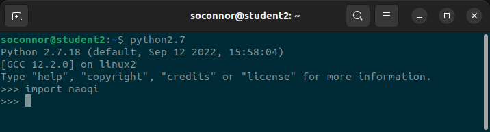

If your output looks like this, installation was successful! 

Exit your Python prompt.

``` python
exit()
```

#### Installing Visual Studio Code

Finally, install an IDE. For this tutorial, we'll be using Visual Studio Code.

Install VS Code from the terminal using the snap package manager.

``` bash
sudo snap install code --classic
```

Then, add the Python extension to VS Code.

``` bash
code --install-extension ms-python.python
```

Your development environment is now set up. Proceed to [creating your first Python project]().

### C++ SDK

#### Installing prerequisites

Begin by opening a terminal. Install the required prerequisites.

``` bash
sudo apt install cmake python3 python3-pip -y
```

#### Installing qiBuild

Next, install the qiBuild build system from the pip package manager.

``` bash
pip3 install qibuild --user
```

#### Setting up qiBuild

Now, configure qiBuild. Run the configuration wizard.

``` bash
qibuild config --wizard
```

The wizard will ask you to choose a CMake generator. Choose `2 Unix Makefiles`.

```
:: Please choose a generator
   1 Green Hills MULTI 	(default)
   2 Unix Makefiles
   3 Ninja
   4 Ninja Multi-Config
   5 Watcom WMake
   6 CodeBlocks - Ninja
   7 CodeBlocks - Unix Makefiles
   8 CodeLite - Ninja
   9 CodeLite - Unix Makefiles
   10 Eclipse CDT4 - Ninja
   11 Eclipse CDT4 - Unix Makefiles
   12 Kate - Ninja
   13 Kate - Unix Makefiles
   14 Sublime Text 2 - Ninja
   15 Sublime Text 2 - Unix Makefiles
> 2
```

The wizard will then prompt you to choose an IDE. Choose `None`.

```
:: Please choose an IDE
   1 None 	(default)
   2 QtCreator
   3 Eclipse CDT
> 1
```

#### Updating your $PATH

Add qiBuild to your $PATH, by adding the following line to your .bashrc file.

``` bash
PATH=$PATH:$HOME/.local/bin
```

!!! tip

    An easy way to add these lines to your .bashrc without opening a text editor would be to echo the lines into the file.
    ``` bash
    echo 'PATH=$PATH:$HOME/.local/bin' >> ~/.bashrc 
    ```

Now, in order to tell your terminal about the updated $PATH, source the .bashrc file.

``` bash
source ~/.bashrc
```

#### Setting up your worktree

Now, we'll set up a worktree. For this tutorial, the worktree will be located at `~/Documents/naoqi-cpp`. This can be changed, however, you'll need to remember the worktree's location.

Start by creating the worktree directory. Go into it, and initialize the worktree.

``` bash
mkdir -p ~/Documents/naoqi-cpp
cd ~/Documents/naoqi-cpp
qibuild init
```

#### Downloading the C++ SDK

Then, download the SDK package from [Aldebaran's website](https://www.aldebaran.com/en/support/nao-6/downloads-softwares).


Under the SDKs > Linux category, choose SDKs 2.8.x - C++ SDK.

#### Extracting the C++ SDK

Go back to your terminal, navigate to where the SDK was downloaded, and extract it. 

``` bash
sudo mkdir -p /opt/naoqi-cpp-sdk
sudo tar -xf naoqi-sdk-*.tar.gz -C /opt/naoqi-cpp-sdk --strip-components=1
```

#### Setting up the C++ SDK

Navigate back to the worktree you created earlier, and create a toolchain from the C++ SDK.

``` bash
cd ~/Documents/naoqi-cpp
qitoolchain create mytoolchain /opt/naoqi-cpp-sdk/toolchain.xml
```

Then, add a new configuration to your toolchain.

``` bash
qibuild add-config myconfig -t mytoolchain --default
```

#### Installing Visual Studio Code

Finally, install an IDE. For this tutorial, we'll be using Visual Studio Code.

Install VS Code from the terminal using the snap package manager.

``` bash
sudo snap install code --classic
```

Then, add the Python extension to VS Code.

``` bash
code --install-extension ms-vscode.cpptools
```

Your development environment is now set up. Proceed to [creating your first C++ project](../cpp-sdk/first-cpp-project.md).

## Other Software

### NAO Flasher

#### Downloading NAO Flasher

Begin by downloading the installer from [Aldebaran's website](https://www.aldebaran.com/en/support/nao-6/downloads-softwares).

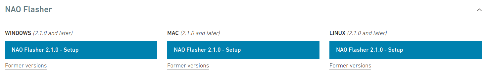

Under the NAO Flasher > Linux category, choose NAO Flasher 2.1.x - Setup.

#### Extracting NAO Flasher

Open a terminal, navigate to where the SDK was downloaded, and extract it. 

``` bash
sudo mkdir -p /opt/nao-flasher
sudo tar -xvf flasher-*.tar.gz -C /opt/nao-flasher --strip-components=1
```
#### Patching zlib

NAO Flasher was developed targeting a version of Ubuntu from 2016. Because of this, we must patch a library in order for the application to launch. 

Go back to your terminal, and run the following commands.

``` bash
cd /opt/nao-flasher/lib/
sudo mv libz.so.1 libz.so.1.old
sudo ln -s /lib/x86_64-linux-gnu/libz.so.1
```

This replaces the bundled version of zlib with the version currently installed on the system.

#### Add Flasher to Applications

Now that we've extracted the flasher, we need to add a launcher to Applications.

Start by creating the launcher file. 

``` bash
touch ~/.local/share/applications/nao-flasher.desktop
```

Next, add the following text to your newly created launcher.

``` desktop
[Desktop Entry]
Version=1.0
Name=NAO Flasher
GenericName=NAO Flasher
Comment=Launches NAO Flasher
Icon=/opt/robot_settings/share/bootconfig/icons/robot_settings.ico
Exec='pkexec env DISPLAY=$DISPLAY XAUTHORITY=$XAUTHORITY /opt/nao-flasher/flasher'
Terminal=false
Type=Application
Categories=Development
Keywords=Robot;SoftBank Robotics
```

!!! tip

    An easy way to add these lines to your launcher without opening a text editor would be to echo the lines into the file.
    ``` bash
    echo "[Desktop Entry]
    Version=1.0
    Name=NAO Flasher
    GenericName=NAO Flasher
    Comment=Launches NAO Flasher
    Icon=/opt/robot_settings/share/bootconfig/icons/robot_settings.ico
    Exec='pkexec env DISPLAY=$DISPLAY XAUTHORITY=$XAUTHORITY /opt/nao-flasher/flasher'
    Terminal=false
    Type=Application
    Categories=Development
    Keywords=Robot;SoftBank Robotics" > ~/.local/share/applications/nao-flasher.desktop 
    ```

Finally, move your newly created launcher file.

``` bash
sudo mv ~/.local/share/applications/nao-flasher /usr/share/applications
```

NAO Flasher is now successfully installed. Launch it from the :material-dots-grid: **Ubuntu Applications Menu**.

Proceed to [Flashing your NAO]().

### Robot Settings

#### Downloading Robot Settings

Begin by downloading the installer from [Aldebaran's website](https://www.aldebaran.com/en/support/nao-6/downloads-softwares).

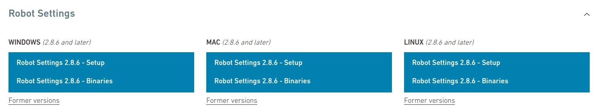

Under the Robot Settings > Linux category, choose Robot Settings 2.1.x - Setup.

#### Installing Robot Settings

After the software downloads, open your file manager and navigate to your downloads directory. Right click the background, and select "Open in Terminal".


Once in a terminal, give the installer execute permissions:

``` bash 
chmod +x robot-settings-*.run
```

Then, run the installer.

``` bash
./robot-settings-*.run
```
The operating system will then prompt you for your administrator password. Enter it, then follow the prompts on the Robot Settings installer. When prompted to choose an install location, leave it at the default `/opt/robot_settings`. The installer will prompt you for your administrator password.

When asked if you want to run the software, make sure to uncheck the box. Then, click finish.

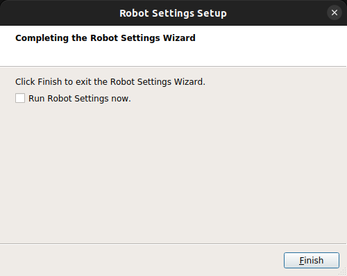

#### Patching zlib

Like most Aldebaran packages, Robot Settings was developed targeting a version of Ubuntu from 2016. Because of this, we must patch a library in order for the application to launch. 

Go back to your terminal, and run the following commands.

``` bash
cd /opt/robot_settings/lib/
sudo mv libz.so.1 libz.so.1.old
sudo ln -s /lib/x86_64-linux-gnu/libz.so.1
```

This replaces the bundled version of zlib with the version currently installed on the system.

Robot Settings is now successfully installed. Launch it from the :material-dots-grid: **Ubuntu Applications Menu**.

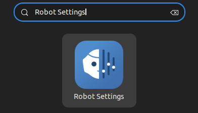
