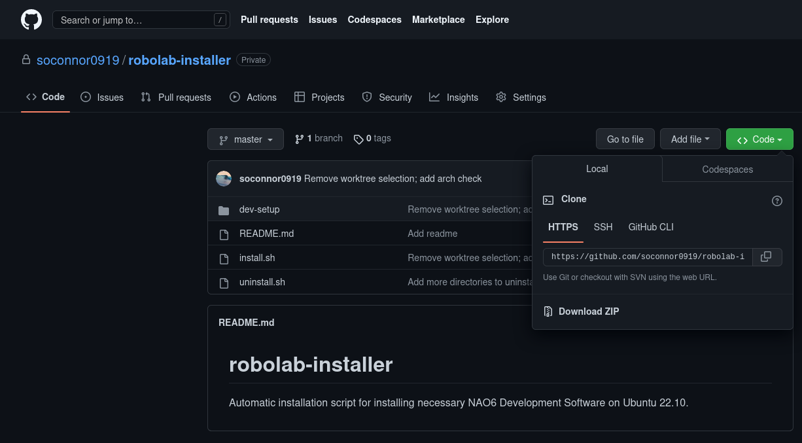
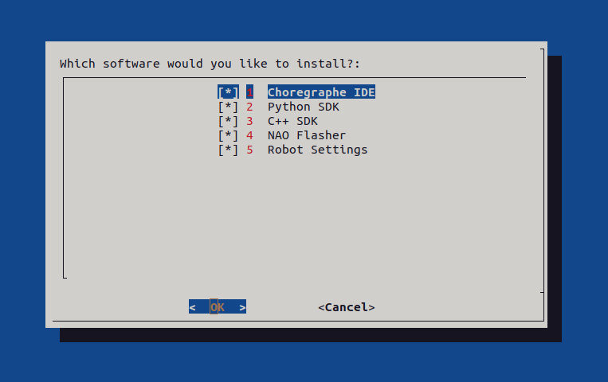
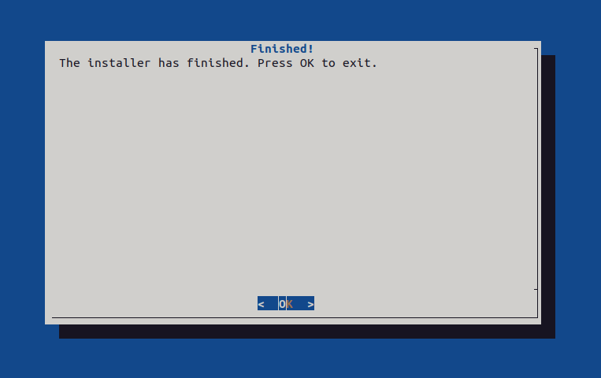

# Using robolab-installer

## What is robolab-installer?

robolab-installer is a collection of scripts developed for the x86_64 edition of Ubuntu 22.10, with the aim of simplifying installation of tools required to begin using and developing software for the NAO6 robot.

The repository for robolab-installer can be found [here](https://github.com/soconnor0919/robolab-installer).

## Downloading robolab-installer

robolab-installer can be downloaded from [GitHub](https://github.com/soconnor0919/robolab-installer).



Once at the repository, click on the green ":octicons-code-24: Code" dropdown, then click ":octicons-file-zip-24:&nbsp;Download ZIP".

## Running robolab-installer

Once the file is downloaded, open your file manager, navigate to your Downloads directory, and extract the folder. 

Then, open up a terminal. Navigate to the directory the file was extracted to.

```bash
$ cd ~/Downloads/robolab-installer-master
```

Next, give the installer execute permission.

```bash
$ chmod +x install.sh
```

Finally, run the installer.

```bash
$ ./install.sh
```

The installer will then ask you what software you'd like to install.



!!! tip

    You'll need to use the keyboard to navigate the installer. Use the up and down arrow keys to make your selection(s). To mark an option as selected, press the spacebar. Press enter to confirm.

Then, you wait. The installer will take a while.

!!! warning

    Don't leave yet! The installer may (at a few points) ask for your password in order to elevate permissions.

After the installer finishes, you will see this message:



The installer has completed. Now, you may move on to [Using your NAO](wip.md).
